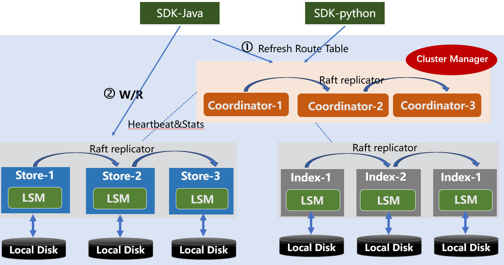

[](https://github.com/dingodb/dingo-store/actions/workflows/ci_ubuntu.yml)
[](https://github.com/dingodb/dingo-store/actions/workflows/ci_rocky.yml)
[](https://github.com/dingodb/dingo-store/actions/workflows/ci_centos.yml)
[](https://github.com/dingodb/dingo-store/actions/workflows/java_build.yml)
[](https://github.com/dingodb/dingo-store/actions/workflows/java_package.yml)

# What's Dingo-Store?

The Dingo-Store project is a distributed KV storage system based on multiple Raft replication groups, which also provides storage layer computation offloading capability. The upper-layer service of this project is DingoDB based on SQL, and it can also provide high-frequency serving storage capability based on KV. The overall architecture of the project is as follows:



## Roles about Dingo-Store

The storage cluster in DingoDB, Dingo-Store, contains the following roles:

### Coordinator

The Coordinator serves as the central metadata management component for the entire DingoDB cluster, utilizing the raft consensus protocol. It maintains the metadata detailing data distribution and the overall topology of the DingoDB cluster. Often referred to as 'the brain' of the DingoDB system, the Coordinator not only holds the cluster's metadata but also oversees resource allocation. For robustness and high availability, the Coordinator operates with a minimum of three nodes. An odd number of Coordinator nodes is recommended for optimal deployment.

### Store

Dingo-Store offers a multi-replica mechanism based on the Raft protocol, ensuring data consistency. It also provides capabilities such as log replication, Leader election, Raft Group migration, snapshot installation, and automatic splitting based on data size. Moreover, Dingo-Store maps all business data models to a Key-Value data model, delivering seamless high-frequency Key-Value read-write capabilities. For instance, it transforms table models and index models entirely into KV representations.

### Index

Dingo-Index is a specialized version of Dingo-Store. It not only offers distributed data storage capabilities but also ensures real-time construction of high-dimensional vector data and its indexing. It provides extensive search capabilities in high-dimensional spaces. The system supports vector index formats such as HNSW and IVF.


# Related Projects about DingoDB

Welcome to visit [DingoDB](https://github.com/dingodb/dingo). The documentation of DingoDB is located on the website: [https://dingodb.readthedocs.io](https://dingodb.readthedocs.io).  The main projects about DingoDB are as follows:

- [DingoDB](https://github.com/dingodb/dingo): A Unified SQL Engine to parse and compute for both structured and unstructured data.
- [Dingo-Deploy](https://github.com/dingodb/dingo-deploy): The deployment project of compute nodes and storage nodes.

# How can you engage with us?

## How to build 

Dingo-Store is a hybrid project of C++ and Java, where C++ provides distributed storage and computing capabilities, while the Java layer provides basic API interfaces.

### Roles of Dingo-Store(C++)

```shell
git submodule sync --recursive
git submodule update --init --recursive
mkdir build && cd build

# Release
cmake -DCMAKE_BUILD_TYPE=Release -DTHIRD_PARTY_BUILD_TYPE=Release -DDINGO_BUILD_STATIC=ON -DBUILD_UNIT_TESTS=OFF ..

# Debug
cmake -DCMAKE_BUILD_TYPE=Debug -DTHIRD_PARTY_BUILD_TYPE=Debug -DDINGO_BUILD_STATIC=ON -DBUILD_UNIT_TESTS=ON ..

# RelWithDebInfo
cmake -DCMAKE_BUILD_TYPE=RelWithDebInfo -DTHIRD_PARTY_BUILD_TYPE=RelWithDebInfo -DDINGO_BUILD_STATIC=ON -DBUILD_UNIT_TESTS=ON ..

make
```

### API of Dingo-Store(Java)

```java
cd java && mvn clean package -DskipTests
```


## How to make a clean pull request

- Create a personal fork of dingo on GitHub.
- Clone the fork on your local machine. Your remote repo on GitHub is called origin.
- Add the original repository as a remote called upstream.
- If you created your fork a while ago be sure to pull upstream changes into your local repository.
- Create a new branch to work on. Branch from develop.
- Implement/fix your feature, comment your code.
- Follow the code style of Google code style, including indentation.
- If the project has tests run them!
- Add unit tests that test your new code.
- In general, avoid changing existing tests, as they also make sure the existing public API is
  unchanged.
- Add or change the documentation as needed.
- Squash your commits into a single commit with git's interactive rebase.
- Push your branch to your fork on GitHub, the remote origin.
- From your fork open a pull request in the correct branch. Target the Dingo's develop branch.
- Once the pull request is approved and merged you can pull the changes from upstream to your local
  repo and delete your branch.
- Last but not least: Always write your commit messages in the present tense. Your commit message
  should describe what the commit, when applied, does to the code – not what you did to the code.


For more detailed information, please refer to: [Guide of Contribution](./docs/contributing.md)


## Contact us

Dingo-Store is an open-source project licensed in **Apache License Version 2.0**, welcome any feedback from the community.
For any support or suggestion, please contact us.


